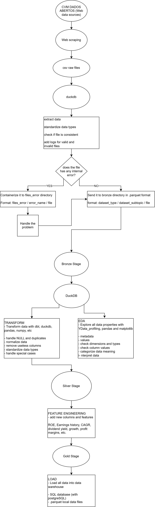

# B3 Equity Pipeline

A Python data pipeline for collecting and preparing Brazilian public-company filings published by the Brazilian Securities and Exchange Commission (CVM). The project is under active development: data extraction is the currently runnable stage, while the complete multi-layer pipeline shown below describes the planned end state.

## Project Status

**In development.** The current entry point recursively scrapes CVM's public company-document directory, downloads ZIP archives, extracts their contents, and removes the downloaded archives. The raw-to-Bronze module is a work in progress and is not called by the entry point. Silver transformations and Gold warehouse loading are planned, not yet implemented.

## Architecture

The diagram shows the intended end-to-end design, including validation and error handling, Bronze and Silver processing, feature engineering, and Gold outputs. It is an overview of the target project; not every stage is available in the current code.



### Planned layers

- **Source and extraction:** collect public CVM filings and extract CSV files.
- **Bronze:** validate files, record valid and invalid inputs, and store standardized data as Parquet. Invalid files are intended to be isolated under `data_lake/files_error/`.
- **Silver:** explore and clean the data, standardize types, and engineer financial indicators such as ROE, earnings history, CAGR, dividend yield, growth, and profit margins.
- **Gold:** make curated data available in a warehouse, with PostgreSQL and local Parquet files shown as planned output options.

## Data Source

At this stage, the pipeline gets data by web scraping the [CVM open-data document directory](https://dados.cvm.gov.br/dados/CIA_ABERTA/DOC/). The CVM has not implemented an API for these datasets, so the scraper traverses the public directory and downloads the available ZIP files. When the CVM provides an API for this data, the ingestion stage will be updated to use it.

The scraper can download a large amount of historical data and requires an internet connection. Run it only when you have enough disk space for the extracted CSV files.

## Requirements

- Python 3.11 or newer
- Internet access to the CVM data directory
- Disk space for the extracted source files

## Setup and Run

The commands below use PowerShell on Windows from the repository root.

1. Create and activate a virtual environment:

	```powershell
	py -3 -m venv env
	.\env\Scripts\Activate.ps1
	```

	If PowerShell blocks activation scripts, activate the environment from Command Prompt with `env\Scripts\activate.bat`, or use the environment's Python directly in the commands below.

2. Install the project dependencies:

	```powershell
	python -m pip install --upgrade pip
	python -m pip install -r requirements.txt
	```

3. Start the current extraction workflow:

	```powershell
	python main.py
	```

`main.py` creates the configured project directories and starts scraping the CVM document directory. The run can take a while because it recursively visits the directory and downloads and extracts ZIP files. Re-running it may download and extract files again.

## Data and Output Directories

Paths are resolved relative to the repository root by `config/directory_settings.py`.

| Path | Purpose |
| --- | --- |
| `data_lake/raw/` | Extracted source files, grouped by dataset and source archive name. |
| `data_lake/bronze/` | Planned standardized Bronze outputs. |
| `data_lake/silver/` | Planned cleaned and enriched data. |
| `data_lake/files_error/` | Intended location for files that fail validation. |
| `data_lake/temporary_files/` | Temporary files used by the in-progress raw-to-Bronze module. |
| `data_warehouse/` | Planned local warehouse outputs. |
| `logs/` | Reserved for pipeline logs. |

The extraction step stores the contents of each archive under `data_lake/raw/<dataset>/<archive-name>/`. The raw lake, warehouse, and virtual environment are excluded from Git; downloaded data is not committed to the repository.

## Repository Structure

```text
assets/                 Architecture diagram
config/                 Directory and logging configuration
src/extract/            CVM web scraper and raw-to-Bronze work in progress
src/transform/           Planned transformation stage
src/load/                Planned warehouse loading stage
data_lake/               Local raw and processing data
data_warehouse/          Planned local warehouse data
main.py                  Current pipeline entry point
requirements.txt         Python dependencies
```

## Current Limitations and Roadmap

- The scraper uses the public website because the CVM does not currently provide an API for these datasets. API-based ingestion is a planned update when one becomes available.
- `src/extract/raw_to_bronze.py` currently prepares UTF-8 temporary CSV files and reads them with DuckDB; it does not yet write Bronze Parquet outputs and is not run by `main.py`.
- File validation, complete error logging, Silver transformations, feature engineering, and Gold loading are represented in the architecture but remain under development.
- The scraper downloads and extracts files without a completed incremental-update or deduplication workflow.

## License

See [LICENSE](LICENSE) for the terms that apply to this project.
